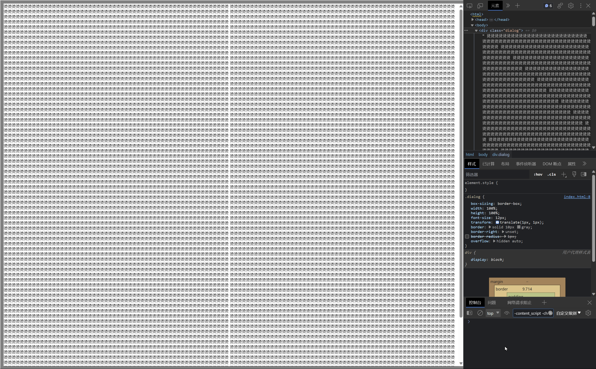
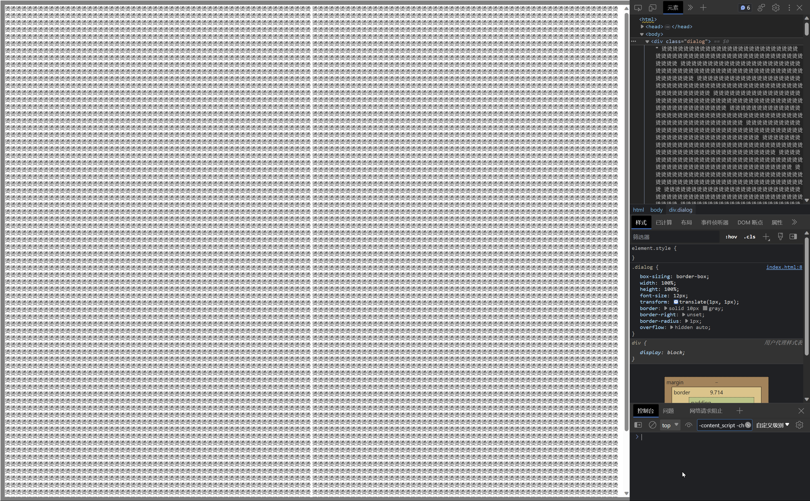

# Low text quality when using specific css props

## in short

Combining the use of these CSS styles and enable scrollbar leads to low-quality text rendering: `transform`、`border`、`border-radius`、`border`

```css
.selector {
  transform: translate(1px, 1px);
  border: solid 10px gray;
  border-right: unset;
  border-radius: 1px;
  overflow: hidden auto;
}
```

## how to reproduce

1. open `index.html`
2. open devtools using f12
3. remove `border-radius: 1px` declare on `.dialog`

## screen shots

### normal quality text



### normal quality text

